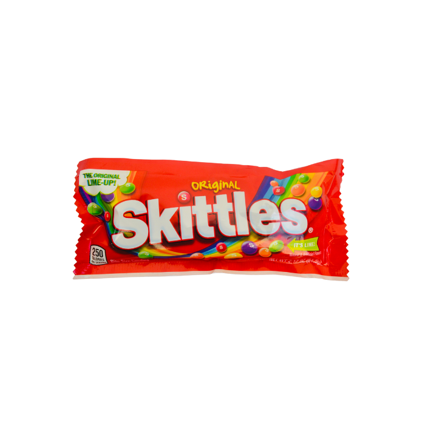
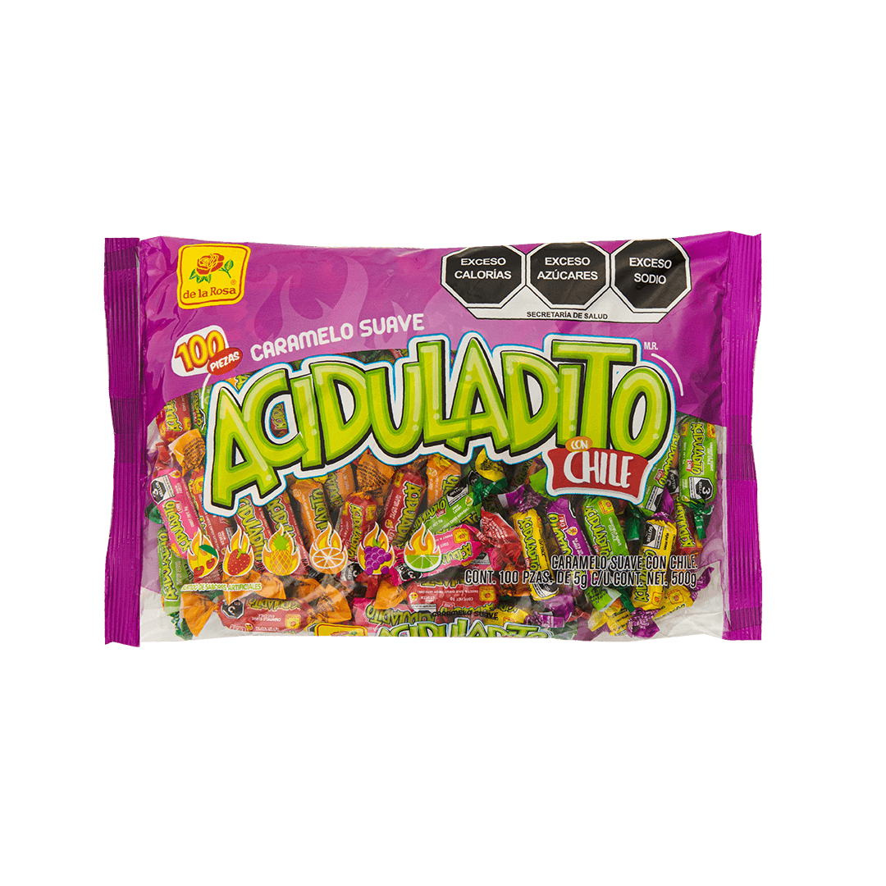
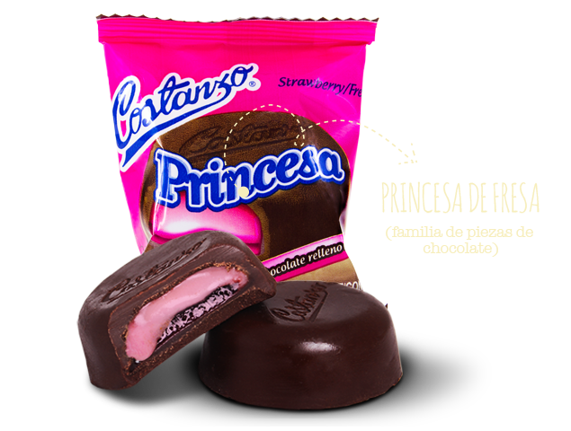
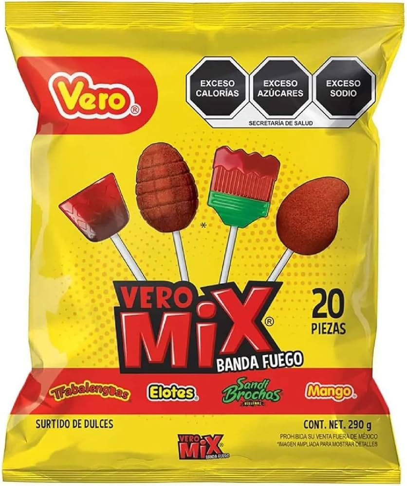
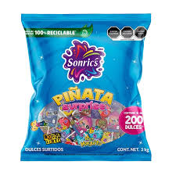
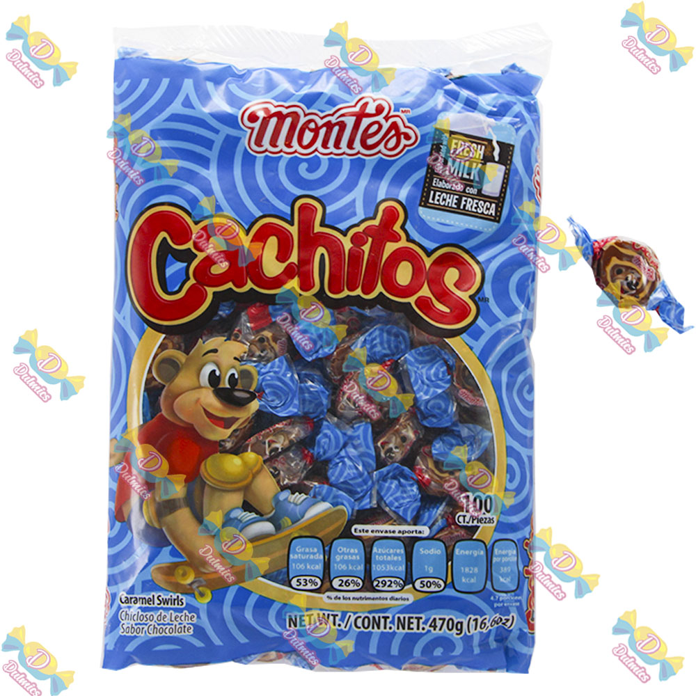
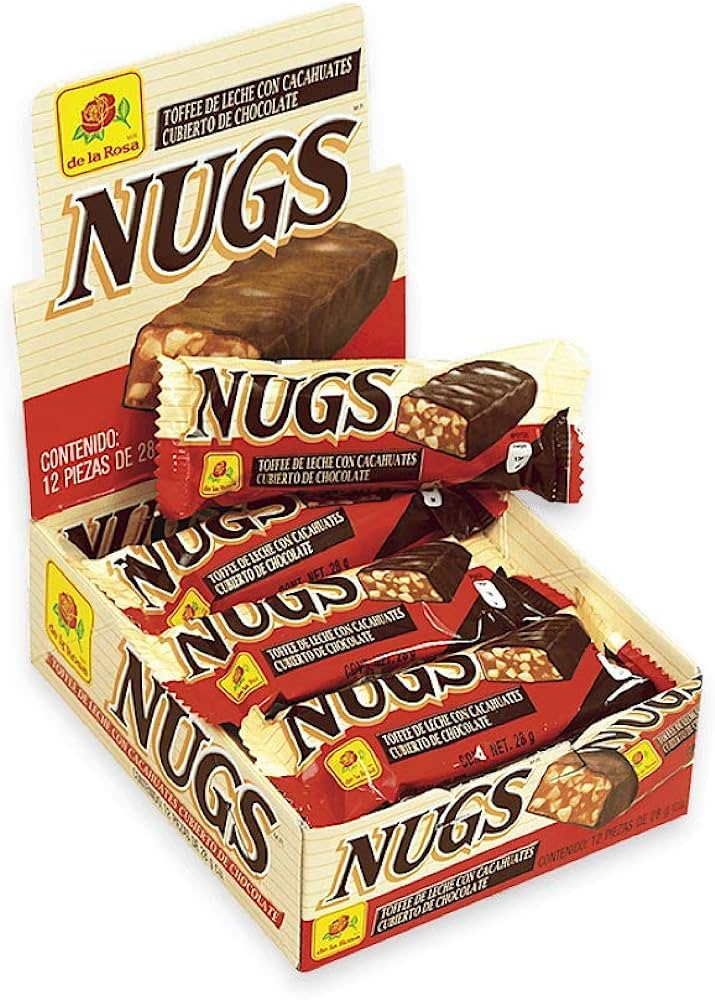
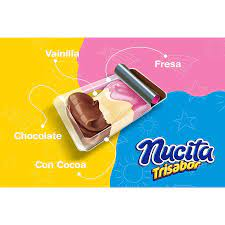

# 🍬 Dulcería Candy - Sistema de Gestión de Inventario y Ventas


## 📋 Descripción

**Dulcería Candy** es una solución web integral diseñada para optimizar la gestión de una dulcería moderna. Este sistema permite administrar eficientemente el inventario, procesar ventas en tiempo real, gestionar usuarios con diferentes roles (Administrador y Empleado), y visualizar reportes detallados.

Construido con una interfaz moderna y atractiva, el sistema ofrece una experiencia de usuario fluida tanto para los clientes que exploran el catálogo como para el personal que gestiona el negocio.

## ✨ Características Principales

### 🛒 Módulo de Ventas y Catálogo
- **Catálogo Público**: Interfaz atractiva para que los clientes vean los productos destacados.
- **Punto de Venta (POS)**: Sistema ágil para procesar ventas, calcular cambios y generar tickets.
- **Carrito de Compras**: Funcionalidad intuitiva para agregar múltiples productos.

### 📦 Gestión de Inventario
- **Control de Productos**: Agregar, editar y eliminar productos con soporte para imágenes.
- **Alertas de Stock**: Visualización clara de productos con bajo inventario.
- **Categorización**: Organización eficiente de dulces y botanas.

### 👥 Administración de Usuarios
- **Roles y Permisos**: Sistema seguro con roles de Administrador (acceso total) y Empleado (acceso a ventas).
- **Gestión de Personal**: Altas, bajas y modificaciones de cuentas de empleados.

### 📊 Reportes y Análisis
- **Historial de Ventas**: Registro detallado de todas las transacciones.
- **Dashboard Administrativo**: Vista rápida de métricas clave y accesos directos.

### 🛠 Herramientas Extra
- **Respaldo y Restauración**: Herramientas integradas para asegurar la base de datos.
- **Configuración del Sistema**: Ajustes generales de la aplicación.

## 🚀 Tecnologías Utilizadas

- **Frontend**: HTML5, CSS3, JavaScript, Bootstrap 5 (Diseño Responsivo).
- **Backend**: PHP (Vanilla).
- **Base de Datos**: MySQL / MariaDB.
- **Iconos**: FontAwesome 6.
- **Estilos**: CSS personalizado con animaciones y gradientes modernos.

## 📸 Galería de Capturas

<div align="center">
  
  
</div>
<br>
<div align="center">
  
  
</div>
<div align="center">
  
  
</div>
<div align="center">
  
  
</div>

## 🔧 Insalación y Configuración

1.  **Clonar el Repositorio**
    ```bash
    git clone https://github.com/Javierxd1383/Punto_De_Venta_Inventario.git
    ```

2.  **Configurar Base de Datos**
    - Importar el archivo `dulceria (3).sql` o el respaldo más reciente en tu gestor de base de datos (phpMyAdmin, Workbench, etc.).
    - Configurar las credenciales en `conexion.php`.

3.  **Ejecutar**
    - Colocar la carpeta del proyecto en `htdocs` (si usas XAMPP).
    - Acceder desde el navegador a `localhost/proyectoIS`.

## 📄 Créditos

Desarrollado por **Javierxd1383**.
Proyecto creado para la gestión eficiente de dulcerías y tiendas de conveniencia.

---
&copy; 2024 Dulcería Candy. Todos los derechos reservados.
